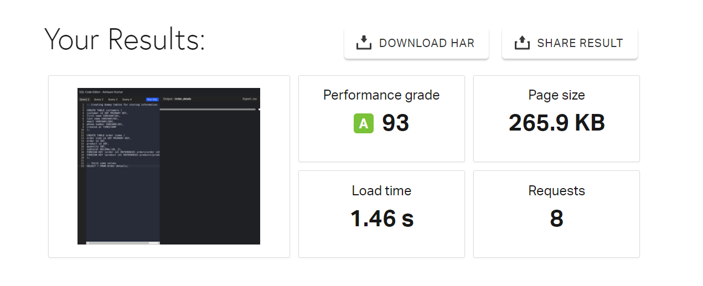

# SQL Editor - Ashwani Kumar

## Overview
This web application allows users to execute SQL queries and view simulated results within the browser. It provides a space to input queries, execute them, and display corresponding dummy data as results.

## Technology Stack
- **Framework:** React.js
- **Dependencies:** react-ace, papaparse
- **Deployment:** Deployed on Vercel [link](https://ashwani-kumar-sql-editor.vercel.app/)

## Features
- **Query Input:** Accepts SQL queries from users.
- **Execution Button:** Executes the entered query.
- **Display Area:** Shows simulated results of executed queries.
- **Multiple Query Support:** Toggle between predefined queries and their results.
- **Pagination/Infinite Scroll (Optional):** Manages large result sets efficiently.

## Load Time
The average load time of the application is approximately 1.46 s seconds. This measurement was conducted using Pingdom Website Speed Test.

## Optimizations
- Implemented memoization for rendering optimization.
- Minimized unnecessary re-renders by utilizing React's memoization and PureComponent.

## Installation
1. Clone the repository.
2. Install dependencies using `npm install`.
3. Start the development server with `npm start`.

